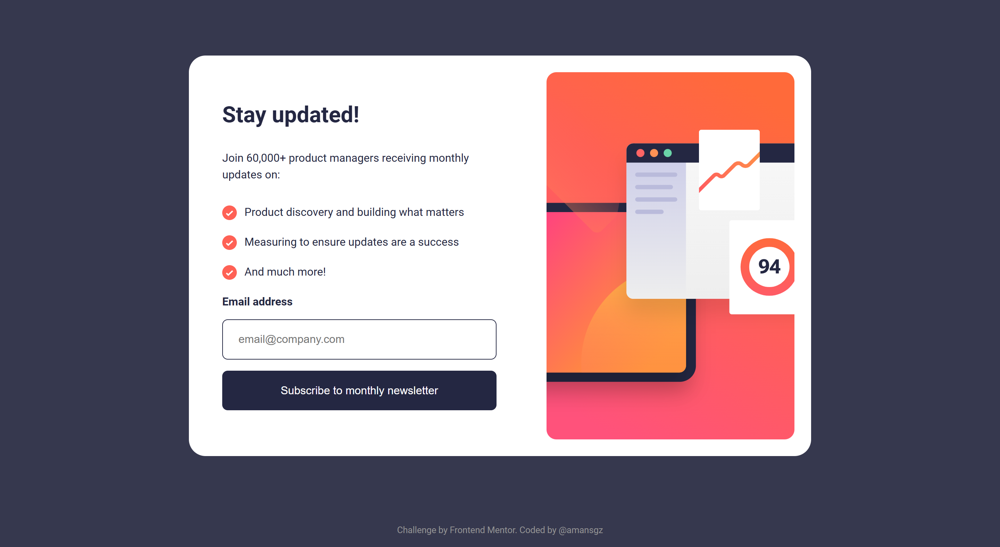

# Frontend Mentor - Newsletter sign up with success message

This is a solution to the [Newsletter sign-up form with success message challenge on Frontend Mentor](https://www.frontendmentor.io/challenges/newsletter-signup-form-with-success-message-3FC1AZbNrv).

## Table of contents

- [Overview](#overview)
  - [The challenge](#the-challenge)
  - [Screenshot](#screenshot)
  - [Links](#links)
- [My process](#my-process)
  - [Built with](#built-with)
  - [What I learned](#what-i-learned)
  - [Continued development](#continued-development)
  - [Useful resources](#useful-resources)
- [Author](#author)
- [Acknowledgments](#acknowledgments)

## Overview

### The challenge

Users should be able to:

- Add their email and submit the form
- See a success message with their email after successfully submitting the form
- See form validation messages if:
  - The field is left empty
  - The email address is not formatted correctly
- View the optimal layout for the interface depending on their device's screen size
- See hover and focus states for all interactive elements on the page

### Screenshot

[view screenshots](./screenshots)

### Links

- Live Site URL: [https://amansgz.github.io/javascript-fundamentals/newsletter-sign-up-with-success-message/index.html](https://amansgz.github.io/javascript-fundamentals/newsletter-sign-up-with-success-message/index.html)

## My process

### Built with

- Semantic HTML5 markup
- BEM Methodology
- CSS custom properties
- Flexbox
- Mobile-first workflow
- JavaScript

### What I Learned

How to implement a sign-up form with email validation and show success message using JavaScript.

### Continued development

I want to continue learning JavaScript and explore new ways to improve my code and build better projects.

### Useful resources

- [JavaScript Fundamentals](https://www.frontendmentor.io/learning-paths/javascript-fundamentals-oR7g6-mTZ) - This challenge is part of Frontend Mentor's learning path. The challenges in this path are designed to guide you through handling common user interactions with JavaScript.

## Author

- Frontend Mentor - [@amansgz](https://www.frontendmentor.io/profile/amansgz)
- Github - [@amansgz](https://github.com/amansgz)

## Acknowledgments

[Frontend Mentor](https://www.frontendmentor.io) for providing this challenge and helping developers improve their skills through realistic projects.
